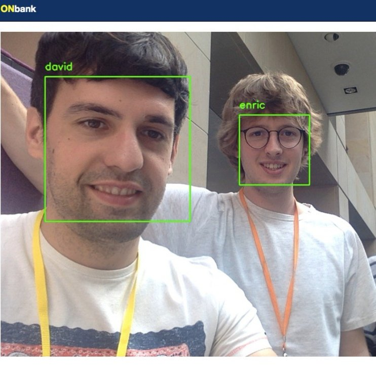
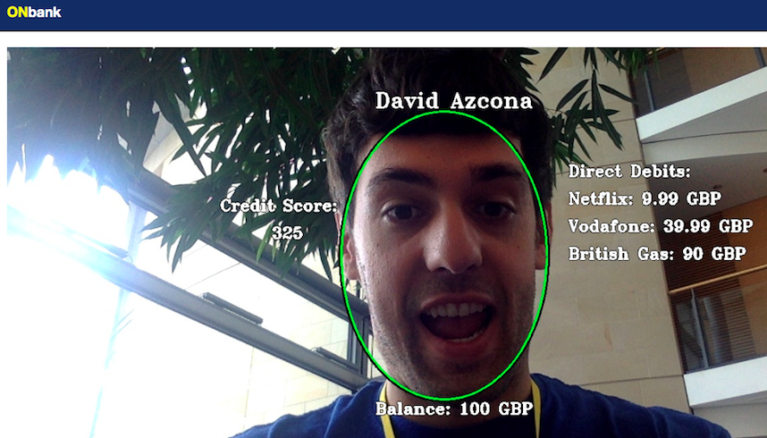

# ONbank

We use AI & Computer Vision to help #BankingTheUnbanked with low digital skills.

[ONbank at Royal Bank of Scotland Hackathon 2019](https://docs.google.com/presentation/d/1nQxYoorTHtbjZ12eEVMSrqdj7dsNQ0YZVGChAqimzG8/edit?usp=sharing)

[ONbank on Twitter](https://twitter.com/onbankuk)




## Technologies

* [Flask](http://flask.pocoo.org/)
* [Bootstrap](https://getbootstrap.com/)
* [Docker](https://www.docker.com/)
* [OpenCV](https://opencv.org/)
* [Face Recognition](https://github.com/ageitgey/face_recognition)

## Deployment

### Docker

Build image with Docker Compose using the Makefile's command:
```
$ make build
```

Run the image to start the container:
```
$ make run
```

## Contributors

* [Enric Moreu](https://github.com/enric1994)
* [David Azcona](https://github.com/dazcona)
* Miriam O'Flynn